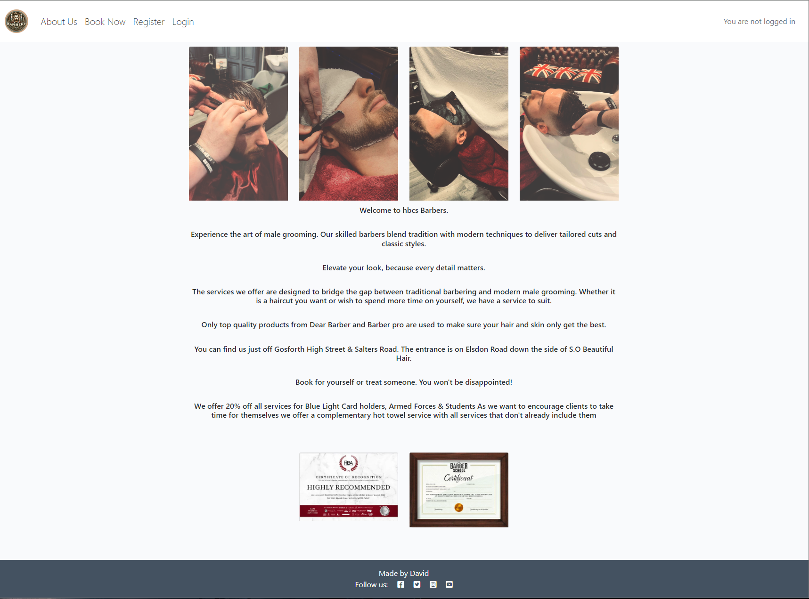
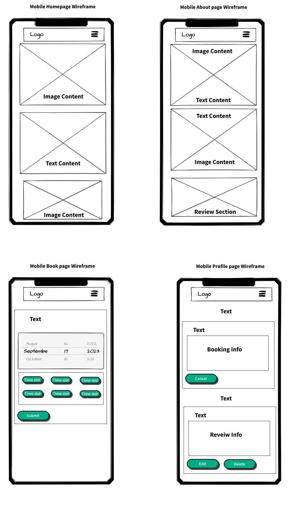
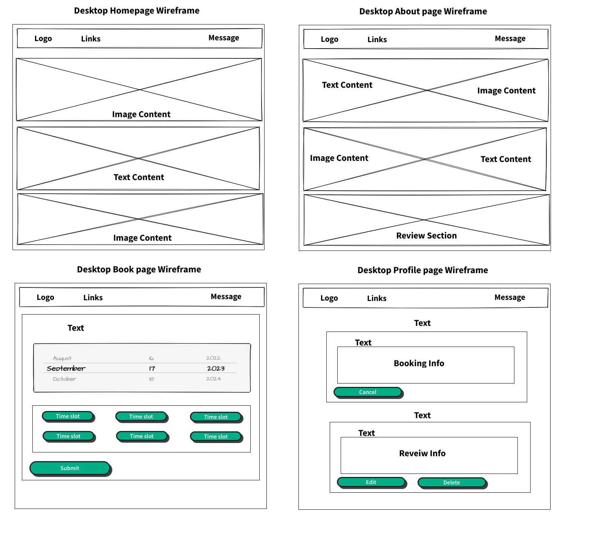
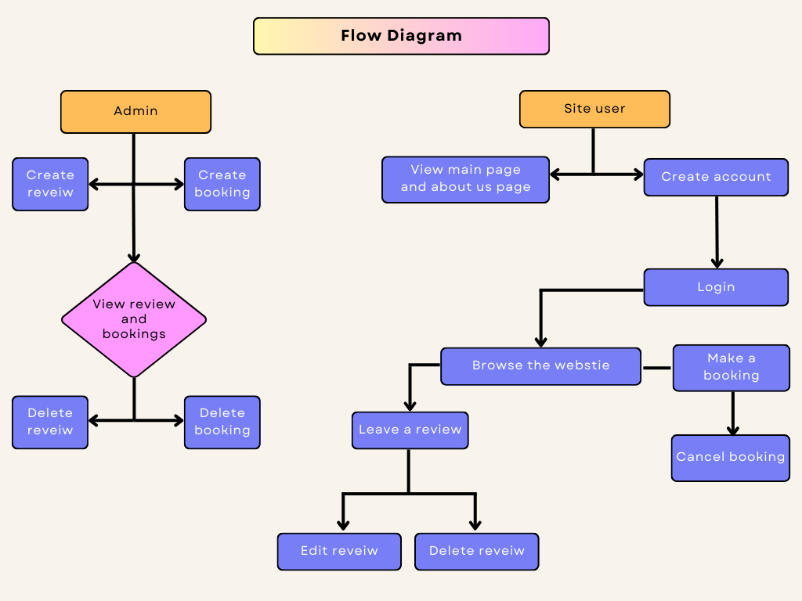
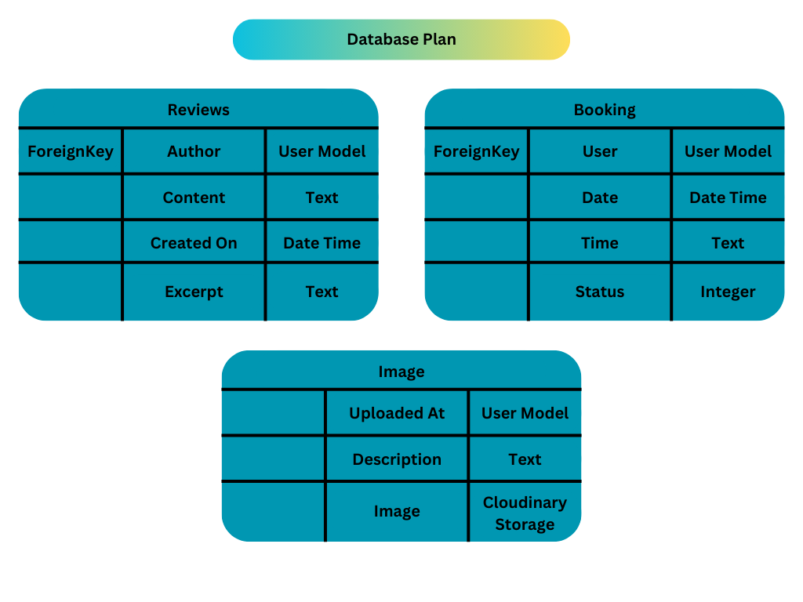
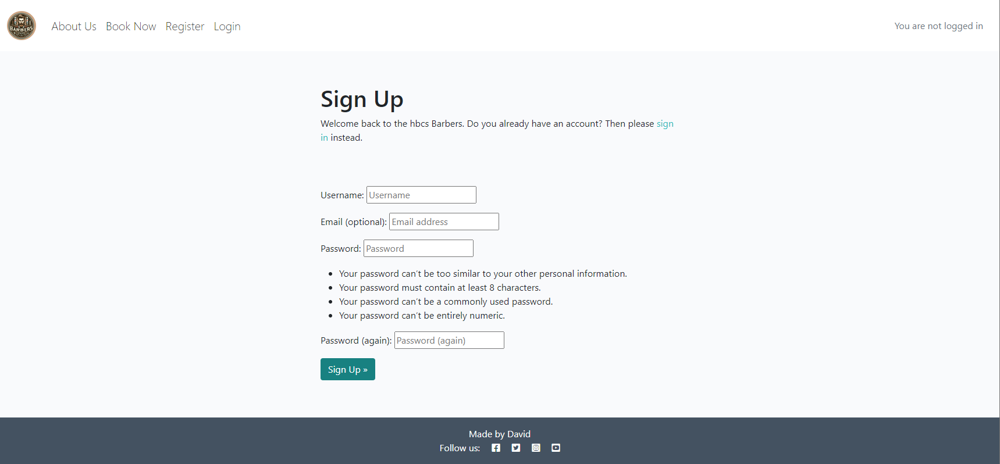
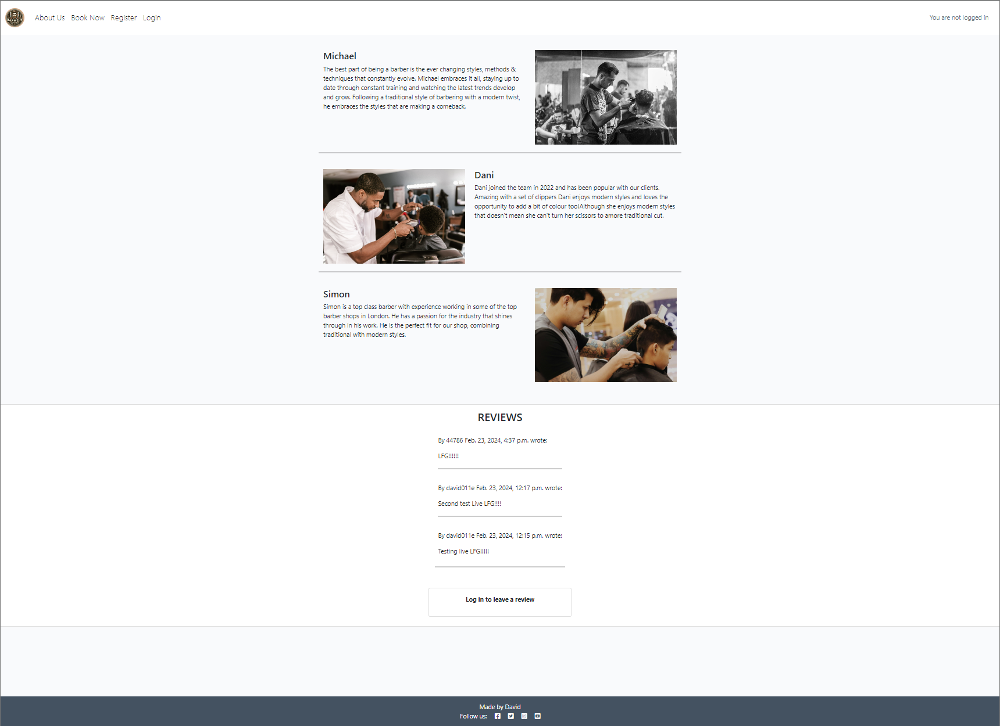
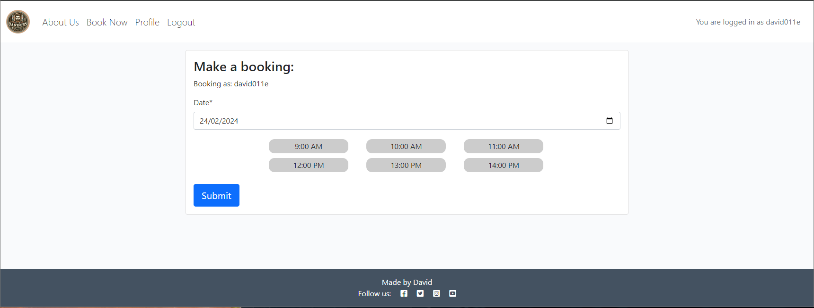
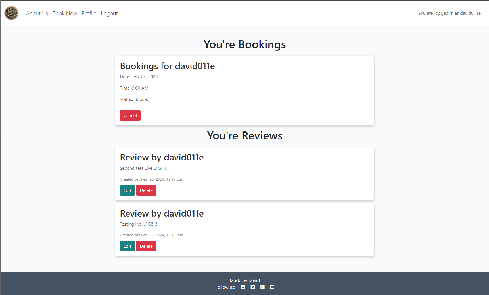

# HBCS BARBER's 

### HBCS BARBER's 

Portfolio 4 project as part of the Diploma in Full Stack Software Development by Code Institute.
___

This is my Online booking system for user to interact by leaving reviews or make a booking for themselves.

It is a fullstack booking system site that allows users to read reviews make a booking , create an account and review about their experiences.

Link to live site - [https://hbcs-a03727698283.herokuapp.com/](https://hbcs-a03727698283.herokuapp.com/)

---

## CONTENTS
- [HBCS BARBER's](#HBCS-BARBER's)
  - [CONTENTS](#contents)
  - [Site Objectives](#site-objectives)
- [User Experience/UX](#user-experienceux)
  - [Target Audience](#target-audience)
  - [User Stories](#user-stories)
    - [New Visitor Goals](#new-visitor-goals)
    - [Existing Visitor Goals](#existing-visitor-goals)
- [Design Choices](#design-choices)
  - [Colour Scheme](#colour-scheme)
  - [Typography](#typography)
  - [Logo and Favicon](#logo-and-favicon)
  - [Wireframes](#wireframes)
  - [Flow Diagram](#flow-diagram)
  - [Database Plan](#database-plan)
- [Features](#features)
  - [Registration](#registration)
  - [Future Features](#future-features)
- [Technologies Used](#technologies-used)
    - [Programming Languages, Frameworks and Libraries Used](#programming-languages-frameworks-and-libraries-used)
    - [Agile](#agile)
- [Testing](#testing)
  - [TESTING.md](#testing)
- [Deployment](#deployment)
    - [Github Deployment](#github-deployment)
    - [Repository deployment via Heroku](#repository-deployment-via-heroku)
    - [Deployment of the app](#deployment-of-the-app)
- [Credits](#credits)

---

  ## Site Objectives

Design and create a Online booking system to demonstrate an increasing understanding of the libraries and frameworks available to developers.

My three main objectives were:

- ### Create a readable, clean and responsive front end

  I wanted to make the site easily accessible and intuitively navigated for the users. Django and Bootstrap were used to create and style the front end.

- ### Make use of available backend functionality

  The use of the backend framework allows users to create a profile, make a booking, review on the about page, as well as deleting their own reviews should they wish to.

- ### Store data on an external cloud database

  I used ElephantSQL to store the PostgreSQL database for this project.

___

# User Experience/UX

## Target Audience

- Users that are interested in getting their hair cut.

## User Stories

### New Visitor Goals

- To understand what the site and content is about.
- How to navigate the site.
- Create an account and engage with the site and other users and site owner.

### Existing Visitor Goals

- Log in and out of their account.
- Read reveiws about other people's experiences.
- Add their own review on the site to engage with site owner and other users.
- Make a booking for them to get a hair cut.

___

# Design Choices

## Colour Scheme

The colour scheme used for this project was based on the colors from Code Institute's 'I think therefore I blog' walkthrough module. I have added and modified many aspects of the styling and colours to suit my intentions. It is a fairly neutral scheme, with only the actionable aspects (buttons/links etc) displayed in brighter colours for ease of navigation or site use.

## Typography

The main font used is Lato.

## Logo and Favicon

The logo was AI generated.

## Wireframes

- Mobile Wireframes

- Desktop Wireframes

## Flow Diagram

Here is a diagram showing the possible flow through the site. There are 2 sections shown here. On the left it shows the Admin and the right shows a site user.

## Database Plan

The database plan is fairly simple, but it shows the information that is stored within the database, the type of data and if it is logged as a Primary or Foreign key where applicable.

---

# Features

## Registration

The user can create an account.

Users can view reviews on About Page and leave a reveiw if they are logged in.

Make a booking page

Profile page this page allows users to see the bookings they made, they can also cancel a booking and it also shows their reviews users can edit or delete them too.

# Technologies Used

Here are the technologies used to build this project:

- [Vscode](https://code.visualstudio.com/) the IDE where the site was built.
- [Github](https://github.com) To host and store the data for the site.
- [PEP8 Validator](https://pep8ci.herokuapp.com/) Used to check python code for errors
- [ElephandSQL](https://www.elephantsql.com/) Used to store PostgreSQL database.
- [Cloudinary](https://cloudinary.com/) Used as cloud storage for images uploaded as part of the blog posts
- [Heroku](https://id.heroku.com/) Used to deploy the project

# Programming Languages, Frameworks and Libraries Used

- [HTML](https://developer.mozilla.org/en-US/docs/Web/HTML)
- [CSS](https://developer.mozilla.org/en-US/docs/Learn/Getting_started_with_the_web/CSS_basics)
- [Javascript](https://en.wikipedia.org/wiki/JavaScript)
- [Python](https://en.wikipedia.org/wiki/Python_(programming_language))
- [Django](https://www.djangoproject.com/)
- [Bootstrap](https://getbootstrap.com/)
- [Ajax](https://en.wikipedia.org/wiki/Ajax_(programming))
- [Sweetalert2](https://sweetalert2.github.io/)
- [datetime](https://docs.python.org/3/library/datetime.html)

# Agile

This project was designed using Agile methodology, utilising the Project Board and Issues sections in GitHub

- [Project Board](https://github.com/users/David011E/projects/7)

## Testing

Please view our [TESTING.md](TESTING.md) file for more information on the testing undertaken.

## Deployment

### Github Deployment

The website was stored using GitHub for storage of data and version control. To do this I did the following;

After each addition, change or removal of code, in the terminal within your IDE (I used codeanywhere for this project) type:

- git add .
- git commit -m "meaningful commit message"
- git push

The files are now available to view within your github repository.

### Repository deployment via Heroku

- On the [Heroku Dashboard](https://dashboard.heroku.com) page, click New and then select Create New App from the drop-down menu.
- When the next page loads insert the App name and Choose a region. Then click 'Create app'
- In the settings tab click on Reveal Config Vars and add the key Port and the value 8000. The credentials for this app were:

1. Cloudinary URL
2. Postgres Database URL
3. Port (8000)

- Below this click Add buildpack and choose python and nodejs in that order.

### Deployment of the app

- Click on the Deploy tab and select Github-Connect to Github.
- Enter the repository name and click Search.
- Choose the repository that holds the correct files and click Connect.
- A choice is offered between manual or automatic deployment whereby the app is updated when changes are pushed to GitHub.
- Once the deployment method has been chosen the app will be built and can be launched by clicking the Open app button which should appear below the build information window, alternatively, there is another button located in the top right of the page.

___

## Credits

The Readme layout was based on the example by [markdaniel1982 - Readme Example](https://github.com/markdaniel1982/MD82-P4?tab=readme)

The wireframe mockups were created using [mockflow wireframes](https://www.mockflow.com/)